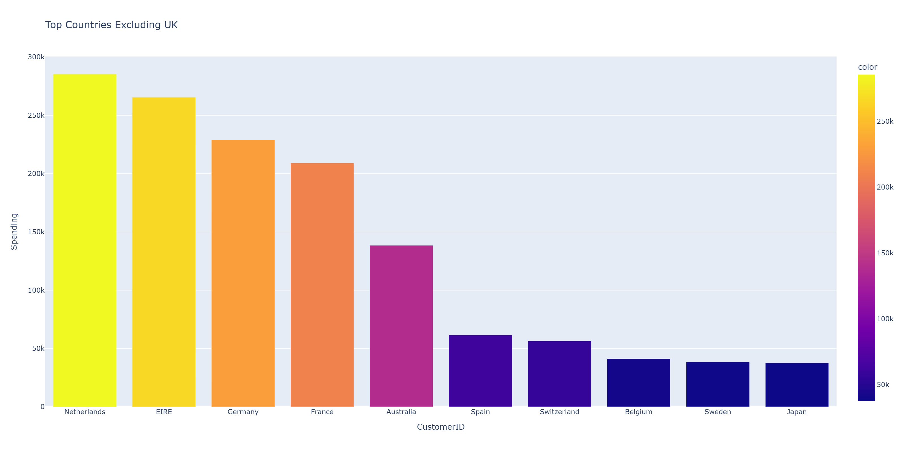

# Online Retail Analysis
**Problem Statement:** Effectively utilize Plotly and SQL to create strong visuals identify trends used in professional settings. 

# Project Overview
This project applies both Python and SQL in a real-world retail dataset containing over 500,000 entries. Using multiple programming languages allows for efficient data analysis whilst performing data cleaning and visualizing.  
The main purpose of this project is to understand the roles of both Python and SQL differ whilst working on a single project. SQL's strengths in data extration directly compliments Python's effectiveness in data visualizations.

# Educational Attainment
* Cleaned and prepared messy data (Removing null rows and negative values).
* Switch between Python and SQL, incorporating the strengths of each programming language
* Converted csv files to databases in order to create queries

# Dataset
This project utilizes the [UCI Online Retail Data](https://www.kaggle.com/datasets/sagnik1511/car-insurance-data/data), which contains over 500,000 transactions from a UK-based online retailer.  
Size: 541909 rows x 8 columns

| Columns | Description |
| :-- | :-- |
| InvoiceNo | Invoice Number (Cancelled orders begin with a 'C') |
| StockCode | Unique 5-digit product code |
| Description | Product name |
| Quantity | Quantity of each product per transaction |
| InvoiceDate | Date and time of transaction |
| UnitPrice | Product price per unit |
| CustomerID | Unique 5-digit code assigned to each customer |
| Country | Name of country where customer resides |

# Technologies Used
* Python:
  * Pandas, Numpy, SQLAlchemy
* Data Visualization:
  * Seaborn, Matplotlib, Plotly
* VS Code as the primary development environment
* SQLite for querying

# Key Insights and Visualizations
### 1. Sales Trend Over Time
This graph showcases the sales from December 1, 2010 to December 9, 2011. Sales increased over time, peaking on September 20th, 2011 with $103.44k of sales and on December 9th, 2011, with $184.35k sales.

### 2. Top Countries by Revenue
One country, the United Kingdom, had a significantly higher total revenue of $7,308,391.55. The UK was excluded from the following graph to improve readability and allow for a more meaningful comparison between the countries. The top countries by revenue are the UK, the Netherlands, Ireland, and Germany.  
  

### 3. Top Selling Products
To improve readability and reduce clutter, the x-axis labels have been removed. The plotly graph includes tooltips which showcases the product names and total revenue when hovered over. The products with the most sales are Paper Craft and Regency Cakestand with $168k and $143k respectively.  
  

### 4. Top Customers
The following graph showcases the customers who have spent the most at this retail store. The customers who have spent the most are customer ID 14646, 18102, 17450.
  

# Future Improvements
* Merge customer demographics
* Predict lifetime customer value
* Build a dashbaord using plotly dash or tableau

# Author
**Kevin Chi**  
Incoming Freshman | University of Michigan - Ann Arbor  
Dual Major: Actuarial Mathematics and Data Science  
kevinchi164@gmail.com